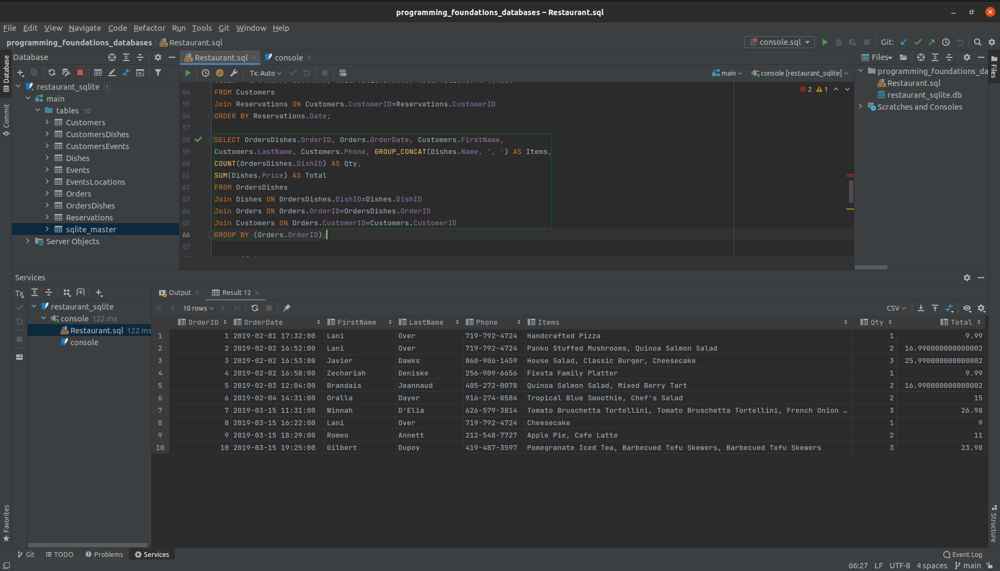

# Programming Foundations: Databases

<p>This 
  <a href="https://www.linkedin.com/learning-login/share?forceAccount=false&redirect=https%3A%2F%2Fwww.linkedin.com%2Flearning%2Fprogramming-foundations-databases-2%3Ftrk%3Dshare_ent_url%26shareId%3D6sfAEyhqSoKKFMkX2yFfyw%253D%253D">course</a>
  is the first part of
  <a href="https://www.linkedin.com/learning/paths/become-a-sql-developer">"Become a SQL developer"</a>
  learning path
</p>

<p>
Learning matirials are
<a href= "https://github.com/LinkedInLearning/databases-pf-784293"> here </a>
</p>

<p> 
To work with database
  <a href="https://www.jetbrains.com/datagrip/">DataGrip</a>
  was used
</p>

<p>
    
</p>
 

 
#### Learning objectives:
- Relational databases
- Keys and unique values
- Planning a database
- Creating tables
- Defining relationships
- Normalization and denormalization
- Writing queries
- Sorting results
- Joining tables
- Modifying data


#### Files
- restaurant_sqlite.db is restaurant database
- restaurant.sql contains some queries for getting and modifying of data

### <p align="center">These are queries demonstrated in Chapter 5</p>


### 05-01: Creating a Database
```SQL
CREATE DATABASE Restaurant;
```

```SQL
USE Restaurant;
```

### 05-02: Creating Tables
```SQL
CREATE TABLE Customers (
    CustomerID INT(6) NOT NULL AUTO_INCREMENT,
    PRIMARY KEY(CustomerID)
);
```

```SQL
CREATE TABLE Customers (
    CustomerID INT(6) NOT NULL AUTO_INCREMENT,
    FirstName VARCHAR(200) NOT NULL,
    LastName VARCHAR(200) NOT NULL,
    Email VARCHAR(200),
    Address VARCHAR(200),
    City VARCHAR(200),
    State CHAR(2),
    Phone VARCHAR(20) NOT NULL,
    Birthday DATE,
    FavoriteDish INT(6) REFERENCES Dishes(DishID),
    PRIMARY KEY(CustomerID)
);
```

### 05-03: Writing SQL Queries
```SQL
SELECT * FROM Customers;
```

```SQL
SELECT * FROM Dishes;
```

```SQL
SELECT Name FROM Customers;
```

```SQL
SELECT FirstName, LastName, Email FROM Customers;
```

### 05-04: Narrowing query results
```SQL
SELECT FirstName, LastName, State FROM Customers;
```

```SQL
SELECT FirstName, LastName, State FROM Customers WHERE State = "CA";
```

```SQL
SELECT FirstName, LastName, State FROM Customers WHERE State = "TX";
```

```SQL
SELECT FirstName, LastName, State FROM Customers WHERE State = "CA" OR State = "CO;
```

```SQL
SELECT FirstName, LastName, State FROM Customers WHERE State LIKE "C%";
```

```SQL
SELECT FirstName, LastName, State FROM Customers WHERE Name = "Taylor";
```

```SQL
SELECT ID, FirstName, LastName, State FROM Customers WHERE Name = "Taylor”;
```

```SQL
SELECT * FROM Reservations WHERE Date > "2019-02-06" AND Date < "2019-02-07”;
```

### 05-05: Sorting results
```SQL
SELECT * FROM Dishes ORDER BY `Name`;
```

```SQL
SELECT * FROM Dishes ORDER BY `Name` ASC;
```

```SQL
SELECT * FROM Dishes ORDER BY `Name` DESC;
```

```SQL
SELECT * FROM Dishes ORDER BY Price;
```

```SQL
SELECT * FROM Reservations ORDER BY `Date`;
```

```SQL
SELECT * FROM Reservations WHERE `Date` > "2019-02-06" AND `Date` < "2019-02-07" ORDER BY `Date`;
```

### 05-06: Aggregate functions
```SQL
SELECT COUNT(FirstName) FROM Customers;
```

```SQL
SELECT COUNT(FirstName) FROM Customers WHERE State = "CA”;
```

```SQL
SELECT COUNT(State) FROM Customers WHERE State = "CA”;
```

```SQL
SELECT SUM(Price) FROM Dishes;
```

```SQL
SELECT SUM(Price), AVG(Price) FROM Dishes;
```

```SQL
SELECT SUM(Price), AVG(Price), MIN(Price), MAX(Price) FROM Dishes;
```

### 05-07: Joining tables
```SQL
SELECT FirstName, LastName, FavoriteDish FROM Customers JOIN Dishes;
```

```SQL
SELECT FirstName, LastName, FavoriteDish FROM Customers
JOIN Dishes ON Customers.FavoriteDish = Dishes.DishID;
```

```SQL
SELECT FirstName, LastName, FavoriteDish, Dishes.`Name` FROM Customers
JOIN Dishes ON Customers.FavoriteDish = Dishes.DishID;
```

```SQL
SELECT FirstName, LastName, FavoriteDish, Dishes.DishID, Dishes.`Name` FROM Customers
JOIN Dishes ON Customers.FavoriteDish = Dishes.DishID;
```

```SQL
SELECT FirstName, LastName, Dishes.`Name` FROM Customers
JOIN Dishes ON Customers.FavoriteDish = Dishes.DishID;
```

```SQL
SELECT * FROM Reservations;
```

```SQL
SELECT FirstName, LastName, Reservations.Date, Reservations.PartySize FROM Customers
JOIN Reservations ON Reservations.CustomerID = Customers.CustomerID ORDER BY Reservations.Date;
```

For MySQL:
```SQL
SELECT OrdersDishes.OrderID, Orders.OrderDate, Customers.FirstName, Customers.LastName, Customers.Phone,
GROUP_CONCAT(Dishes.`Name` SEPARATOR ', ') AS Items,
COUNT(OrdersDishes.DishID) AS Qty,
SUM(Dishes.Price) AS Total
FROM OrdersDishes
JOIN Dishes on OrdersDishes.DishID = Dishes.DishID
JOIN Orders on Orders.OrderID = OrdersDishes.OrderID
JOIN Customers on Orders.CustomerID = Customers.CustomerID
GROUP BY(Orders.OrderID);
```

For SQLite:
_SQLite doesn’t support the `SEPARATOR` keyword in `GROUP_CONCAT()`._
```SQL
SELECT OrdersDishes.OrderID, Orders.OrderDate, Customers.FirstName, Customers.LastName, Customers.Phone,
GROUP_CONCAT(Dishes.`Name`, ', ') AS Items,
COUNT(OrdersDishes.DishID) AS Qty, SUM(Dishes.Price) AS Total
FROM OrdersDishes
JOIN Dishes on OrdersDishes.DishID = Dishes.DishID
JOIN Orders on Orders.OrderID = OrdersDishes.OrderID
JOIN Customers on Orders.CustomerID = Customers.CustomerID
GROUP BY(Orders.OrderID);
```

### 05-08: Modifying data
```SQL
INSERT INTO Customers;
```

```SQL
INSERT INTO Customers (FirstName, LastName, Email, Phone)
VALUES ("Jane", "Smith", "jsmith2019@landonhotel.com", "415-555-1234");
```

```SQL
SELECT * FROM Customers WHERE FirstName = "Taylor" AND LastName = "Jenkins";
```

```SQL
SELECT * FROM Customers WHERE CustomerID = 1;
```

```SQL
UPDATE Customers SET Email = "tjenkins@landonhotel.com" WHERE CustomerID = 1;
```

```SQL
SELECT * FROM Customers WHERE CustomerID = 1;
```

```SQL
SELECT * FROM Customers WHERE FirstName = "Taylor" AND LastName = "Jenkins";
```

```SQL
DELETE FROM Customers WHERE CustomerID = 26;
```

```SQL
SELECT * FROM Customers;
```
