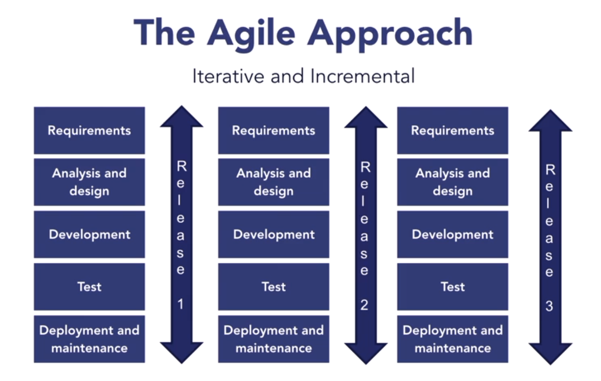

# 1. Agile Fundamentals

## The software crisis

The rise in popularity of Agile methodologies can be attributed to what is commonly known as the software crisis the challenge of creating efficient and useful computer programs in a specific, defined timeline. Compounding the crisis was the trend of managing software teams with the same methods used for manufacturing or construction projects. Generally manufactured products are identical, think about cars of the same make and model coming down an assembly line one after another. Design engineers and managers typically produce well defined checklists with well defined processes and tools that workers are expected to follow. Comprehensive system documentation is produced so defects can be tracked and fixed easy. And in construction, once you sign a contract to build a house, the requirements are frozen, if you want something changed or added there is an additional cost. Change is generally frowned upon and as time passes making changes becomes more and more costly. Early software development tried to mimic the construction and manufacturing approach by following what is known as the waterfall model.

    

Waterfall has five phases:
- requirements
- analysis and design
- development
- test
- deployment and maintenance.

Each phase ends with a well defined frozen deliverables that act as inputs for the next phase. Requirements are captured early and are used as inputs for analysis and design. When the analysis and design phase is completed, we have a fully designed system that is ready for development. When development is done, the system is expected to be ready for testing and so on and so forth.

So, what's wrong with this approach? There are two obvious issues.

The first problem is that the customer does not get to see the product before the early testing phase, which is usually two thirds of the way through the product timeline. You could be in the deployment and maintenance phase before you would realize that the product you are building was no longer viable due to changed market conditions or organizational direction or changed. Or you could realize that the product had a major architectural flaw that prevented it from being deployed. In other words your product development initiative could completely fail after a lot of money and time had been spent on it.

The second problem with the waterfall approach is that it uses top down management. Development team members are expected to follow checklists and detailed controls, in other words this approach strategizes processes over people. Each phase is gated and has entry conditions before the development team can start working on the next phase.

The software industry started debating the manufacturing industry like approach used for developing software as early as the 90's. According to a 1994 Standish Group report, only around 16 percent of the projects surveyed were successfully finished within budget and on time with the features originally scoped. 53 percent of software projects went either over budget, lacked features, did not finish on time, or a combination of these. And according to a 2000 book by Scott Ambler and 85 percent of software projects surveyed ended up as failures. So clearly a new approach was required for software development.

## Agile to the rescue

&emsp;
When developing software, change is unavoidable. Requirements change for a variety of reasons. The technology used to build the software becomes obsolete, companies merge or are acquired, the competitive landscape shifts, or team members leave just to name a few common scenarios. In other words, change is the only certainty. This makes software development risky and creates a strong need for unplanned adjustments, customer feedback, and continuous improvement. To manage these challenges, the software developer must be creative and knowledgeable. They cannot rely entirely on detailed predictive planning, checklists, and controlled processes created by someone else.  

&emsp;
Software development is an empirical process which relies on facts and real experiences. Software developers use empiricism to continuously change and improve their plans. Software is built iteratively and in small increments. Each step involves requirements capture, refinement, software analysis and design, building code, unit integration and system testing, deployment, maintenance and bug fixes. At the end of each iteration, a usable software product is produced. This enables software teams to address risks and uncertainties associated with software development at each stage of the process.

&emsp;
In the nineties, many agile techniques evolved that attempted to solve key challenges facing the software industry. The first attempt, to officially define the agile approach was in 2001 when a group of thought leaders defined what is known as the Agile Manifesto. The Agile Manifesto has four tenets.

- The first is, "Individuals and interactions over processes and tools." The agile mindset values people and their interactions over detailed processes, and the comprehensive use of tools.

- The second tenet is the preference of working software over comprehensive documentation. What good is a detailed data model of the backend database that supports a website, if the website itself does not work? Working software is the ultimate proof of the success of a software development initiative.

- The third tenet is the preference of customer collaboration over contract negotiation. Collaborating with customers to build something that delights them is more important than executing contracts with fixed requirements.

- The last item is a preference of responsiveness to change over following a preordained plan.

&emsp;
Agile teams embrace change. It's important to note that the Agile Manifesto is not against processes, tools, documentation, contracts, or plans. It just places a higher priority on the four tenets it outlines. The Agile Manifesto reflects the collective wisdom of many industry leaders to lay the foundation of a mindset that is best suited to build complex software products in unpredictable environments.

